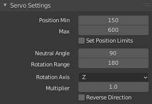
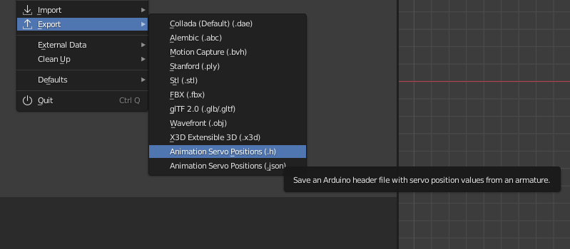
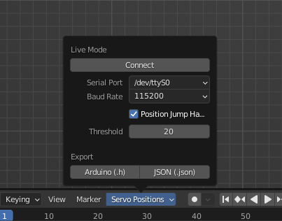

# Blender Servo Animation Add-on

Export your Blender animation to servo position values. They can be used with an Arduino compatible micro controller to move PWM-driven servos according to your animation.

Animate your robot or animatronic project and take advantage of Blender's animation tools!

Also check out the [Blender Servo Animation Arduino Library](https://github.com/timhendriks93/blender-servo-animation-arduino) which is specifically designed to work with this add-on.

## Features

- Represent servos through armature bones
- Provide individual `Servo Settings` per bone
- Export an animation as servo position values
- Send position values via a serial connection in real-time
- Supporting Inverse Kinematics (IK)

## Installation

> Note: this Add-on is compatible with Blender version **2.90 or higher**.

1. Download the [latest version of the Add-on](https://github.com/timhendriks93/blender-servo-animation/releases/latest/download/blender_servo_animation_addon.zip) as a ZIP archive.
2. Open Blender and go to `File > Preferences > Add-ons`.
3. Click the `Install...` button, select the previously downloaded ZIP and click `Install Add-on`.
4. Enable the Add-on by checking the checkbox in the Add-ons list.

More information and screenshots can be found in the official [Blender Manual](https://docs.blender.org/manual/en/latest/editors/preferences/addons.html#add-ons).

## Providing Servo Settings

After enabling this Add-on, you should see a `Servo Settings` panel within the `Bone Properties` tab. This tab will be available once you select a bone while being in `Edit` or `Pose` mode.

The underlying principle is that each bone represents a servo motor in the real world. To treat a bone as a servo and activate the `Servo Settings`, enable the checkbox in the panel header.

### Servo Setting Properties

| Property | Description |
| -------- | ----------- |
| Servo ID | Unique number between `0` and `255` to identify this servo (used to send serial commands) |
| Position Min | The minimum position value to identify this servo physically stops moving |
| Position Max | Same as `Position Min`, but for the maximum value |
| Set Position Limits | Define a position range to limit the calculated position values according to a specific build |
| Position Limit Start | The minimum position value before the servo is supposed to stop moving within a specific build |
| Position Limit End | Same as `Position Limit Start`, but for the end value |
| Neutral Angle | The assumed neutral angle of the servo in degrees (typically half the rotation range) which should be adjusted carefully, since the servo will first move to its 'natural' neutral angle when powered |
| Rotation Range | The manufactured rotation range of the servo in degrees (typically `180`) |
| Euler Rotation Axis | The Euler rotation axis (`X`, `Y` or `Z`) of the bone rotation representing the servo movement |
| Multiplier | Multiplier to increase or decrease the rotation to adjust the intensity within a specific build |
| Reverse Direction | Whether the applied rotation should be reversed when converting to position value which might be necessary to reflect the servo's positioning within a specific build |

### Choosing a Position Value Range

The default position min and max values are based on servo pulse lengths as they are required when using a library to control a servo driver module, like the `PCA9685`.

It is also possible to use a different kind of value range. For example, to use the default Arduino Servo library, you can use a degrees value range by setting min to `0` and max to `180`.

> Note: the correct settings vary between different servo brands and models. Be careful not to damage the servo when finding the min and max position values.

### Limiting the value range

The possible range of motion of a servo can be influenced by the specific design of your build. In this case, you can measure and use the position limit values to avoid damage to your setup.

You can also take advantage of Blender's functionality and use [bone constraints](https://docs.blender.org/manual/en/latest/animation/constraints/transform/limit_rotation.html) to already limit the bone rotation according to your build. The more precise your 3D model, the easier it will be to apply constraints and get an accurate preview of the real-world setup.

## Animating the Armature

When animating your armature you can benefit from all the exciting animation features Blender has to offer. Apart from animating every bone/servo separately, you can also use IK ([Inverse Kinematics](https://www.youtube.com/watch?v=S-2v_CKmVE8)) to let the Add-On calculate the positions of multiple servos automatically.

When thinking of animatronic or robotic projects, you could animate a head or arm without having to worry about the individual bones/servos that make up the neck mechanism or arm segments. To further illustrate this, you can also find an [example of a neck mechanism](examples/IK/ik.blend) to learn about the armature and constraints setup.

## Exporting

Once all servo settings are provided and your animation is ready, you can calculate and export the servo position values.

Make sure to select the armature containing the bones/servos you want to export and choose the desired format in the `File > Export` menu:

Alternatively, you can also trigger the export via the timeline menu which is shown in the live mode section below.

### Export Formats

There are two different formats to choose from:

1. `Animation Servo Positions (.h)`: An Arduino/C/C++ style header file which can be easily included in an Arduino project.
2. `Animation Servo Positions (.json)`: A simple (non-formatted) JSON file which can be used in a more generic way.

### Using the Exported Data

For projects which involve an Arduino compatible microcontroller, the easiest way to work with the exported data is by using the dedicated [Blender Servo Animation Arduino Library](https://github.com/timhendriks93/blender-servo-animation-arduino). This library allows you to map the exported positions to a servo representation and add custom logic to actually send servo control signals. Check out the library's repository for more details and some read-to-use examples.

Apart from using the library, it is also possible to write use the exported data in any other kind of program. Especially the JSON format simply represents a list of position values which can be easily parsed via code.

## Live Mode via Serial Connection

To make the animation process even more intuitive, you can enable the `Live mode` to send position commands via a serial connection (UART/USB). This will allow you to control your servos in real-time from within Blender.

After enabling the add-on, you can find the `Servo Positions` popover menu in the header of the timeline. Here you can prepare and control the serial connection for the `Live mode`. For additional convenience, you can also find buttons to export the servo positions here.

### Setup a Serial Connection

To use the `Live Mode`, you will need to prepare a receiver which will interpret the received commands and use them to control the servo motors accordingly. In most cases, the receiver can be considered an Arduino compatible micro controller which is connected via USB to your PC.

Once the micro controller is connected, the add-on will try to find and list the respective `Serial Port`. If there are multiple ports and you are unsure which one belongs to your controller, simply compare the list of ports after removing and re-connecting the device.

The `Baud Rate` specifies at which rate or speed the data will be transferred. It might need to be adjusted according to the limitations and configurations of your receiver. Keep in mind that a high frame rate combined with a multitude of servos requires a faster data transmission to achieve a smooth movement. As a reference, it was possible to smoothly control `16 servos` at `60 fps` with a baud rate of `115200`.

Once the `Serial Port` and `Baud Rate` have been set, you can click the `Connect` button to establish the serial connection and start the `Live Mode`.

> Note: starting the `Live Mode` will immediately send the position values for all servos based on the current frame. Make sure that this will not break anything, as the servos will try to move to their new position as fast as possible.

### Position Jump Handling

Once the connection is established, you can use the timeline to control your servos in a synchronized way. This opens up the possibility to jump to a different frame or position within your animation. To prevent damage due to the servos moving too quickly, you can use `Position Jump Handling` and define a respective `Threshold`. This option is enabled by default.

When clicking somewhere in the timeline and therefore jumping to a different frame, the add-on will first calculate all position value differences. If one of those differences exceeds the `Threshold` value, the servos will be slowly moved to their new target position. This is done by sending multiple position values in small increments. During this process, the user interface will show a progress indicator.

### Serial Protocol

The position values are sent based on a specific binary protocol. The receiver has to know about it and be able to interpret the received data in order to successfully trigger the correct servo movement.

The protocol defines in which order and pattern individual bytes are transferred. The following table shows the protocol structure based on an example where the servo with the ID `0` should receive the position value `375`:

| | Start | Servo ID | High Pos | Low Pos | End |
| --- | --- | --- | --- | --- | --- |
| ASCII | < | 0 | 1 | 119 | > |
| Decimal | 60 | 0 | 1 | 119 | 62 |
| Hexadecimal | 0x3C | 0x00 | 0x01 | 0x77 | 0x3E |

The position value is split into 2 bytes (high and low), while the first byte is the most significant one.

### Reading Serial Commands on an Arduino

Instead of writing your own logic to read and interpret the serial commands, you can also use the [Blender Servo Animation Arduino Library](https://github.com/timhendriks93/blender-servo-animation-arduino) which has a built-in support for the live mode. Check out the library's repository for more details and some read-to-use examples.
