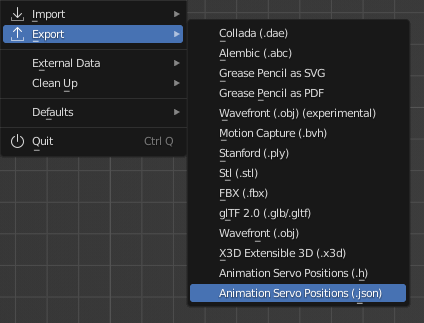

# Blender Servo Animation Add-on

Export your Blender animation to servo position values. They can be used with an Arduino compatible micro controller to move PWM-driven servos according to your animation.

Animate your robot or animatronic project and take advantage of Blender's animation tools!

## Installation

Note that this Add-on is compatible with Blender version 2.80 or higher.

1. Download the `blender_servo_animation_addon.py` file.
2. Open Blender and go to `File > Preferences > Add-ons`.
3. Click the `Install...` button, select the previously downloaded file and click `Install Add-on`.
4. Enable the Add-on by enabling the checkbox in the Add-ons list.

## Usage

### Providing Servo Settings

After enabling this Add-on, you should be able to define servo settings for each bone of an armature. The underlying principle is that each bone represents a servo motor in a real world build.

Make sure to select a specific bone within the armature while in Edit or Pose mode. You should now see a panel showing the current servo settings for the selected bone.

| Property             | Description                                                                                                                                                                                           |
| -------------------- | ----------------------------------------------------------------------------------------------------------------------------------------------------------------------------------------------------- |
| Position Min         | The minimum position value before the servo physically stops moving                                                                                                                                   |
| Position Max         | Same as `Position Min`, but for the maximum value                                                                                                                                                     |
| Set Position Limits  | Define a position range to limit the calculated position values according to a specific build                                                                                                         |
| Position Limit Start | The minimum position value before the servo is supposed to stop moving within a specific build                                                                                                        |
| Position Limit End   | Same as `Position Limit Start`, but for the end value                                                                                                                                                 |
| Neutral Angle        | The assumed neutral angle of the servo in degrees (typically half the rotation range) which should be adjusted carefully, since the servo will first move to its 'natural' neutral angle when powered |
| Rotation Range       | The manufactured rotation range of the servo in degrees (typically 180)                                                                                                                               |
| Euler Rotation Axis  | The Euler rotation axis (X, Y or Z) of the bone rotation representing the servo movement                                                                                                              |
| Multiplier           | Multilplier to increase or decrease the rotation to adjust the intensity within a specific build                                                                                                      |
| Reverse Direction    | Whether the applied rotation should be reversed when converting to position value which might be necessary to reflect the servo's positioning within a specific build                                 |

Note that the correct settings vary between different servo brands and models. Be careful not to damage the servo when finding the min and max position values. The range of motion of a servo can be limited depending on your specific build design. In this case you can use the position limit values to avoid damage to your build.

### Exporting

Once all servo settings are provided and the animation is completed, you can calculate and export the servo position values. There are two different formats to choose from:

1. `Animation Servo Positions (.h)`: An Arduino/C/C++ style header file which can be easily included in an Arduino project.
2. `Animation Servo Positions (.json)`: A simple (non-formatted) JSON file which can be used in a more generic way.

Make sure to select the armature containing the bones/servos you want to export and select the desired format in the `File > Export` menu:

## Final thoughts

The default position min and max values are based on servo pulse lengths as they are required when using a library to control a servo driver module, like the PCA9685. It is also possible to use a different kind of value range. For example, to use the default Arduino Servo library, you can use a degrees value range by setting min to `0` and max to `180`.

You will also find an [example Arduino project](examples/ArduinoBlenderServoAnimation/ArduinoBlenderServoAnimation.ino) to test your animation with the help of a micro controller and a single servo.